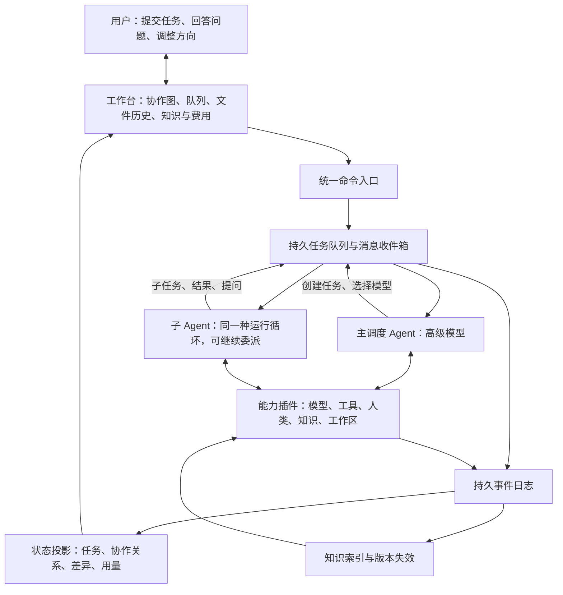

# 统一多模型协作架构 v2

2026-09-11 · 架构设计，尚未实现或进行真实模型评测。

本版依据用户提出的七项要求重写。核心选择：让 AI 决定如何工作，以统一的 Agent 循环、工具协议和事件记录承载协作。原版保存在 [archive/融合方案设计-v1.md](archive/融合方案设计-v1.md)。

## 1. 架构原则

**一个 Agent 抽象，一个事件事实源，一组可组合能力。主调度者与子智能体使用同一套运行机制。**

AI 自主决定任务拆分、模型选择、串行或并行、继续委派、请求人类、验证方式以及何时交付。程序不根据“简单/中等/复杂”分派固定流程，也不强制所有任务经过规划者、执行者和审查者。

运行时保留少量与任务内容无关的不变量：调用格式合法、权限不越界、预算不透支、任务不被重复领取、结果不覆盖较新的版本、取消有效。这些是执行语义，不是替 AI 编写业务决策树。AI 的自主性不要求程序放弃状态一致性。

流程图展示运行中形成的协作关系；可以单独展示 AI 提出的计划，但必须与已经执行的事实区分。

DeepSeek Harness 的启发是能力插件化：模型、工具、会话、调度和 UI 经由服务和事件协作，其 Cordis 内核只处理插件生命周期与依赖。本方案借鉴这一分层，不宣称下面的自定义协议已由 DSH 实现。[官方介绍](https://www.deepseek.com/harness/)

## 2. 一张架构图



图中的队列分配执行资源；主调度模型决定任务的语义安排。文件变化、token 流等高频事件写入日志和界面，不自动逐条唤醒主模型。需要主模型处理的用户消息、阶段结果和问题进入其收件箱，可合并为一次通知。

## 3. 极小内核与能力插件

内核只提供插件注册/依赖/生命周期、服务查找和事件分发。持久日志、Agent 循环、队列等也以插件实现；默认产品组合要求它们存在，但接口允许替换。

| 能力 | 职责 | 面向 AI 的接口示意 |
|---|---|---|
| Agent Runtime | 会话、收件箱、模型调用和继续执行 | 通常由运行时驱动 |
| Model Catalog | 可用模型、能力、价格、实测表现、上下文与工具支持 | `models.list` |
| Tasks | 创建任务、依赖、优先级、领取、暂停和恢复 | `tasks.submit/get/update/await/cancel` |
| Communication | 给父级、子级或其他获准会话发消息 | `agents.send` |
| Human | 创建问题、收取回答、恢复关联任务 | `human.ask` |
| Knowledge | 检索、读取版本化知识、提交有来源的结论 | `knowledge.search/read/publish` |
| Workspace | 读取、编辑、执行命令、查看差异、快照与归档 | `workspace.*` |
| Artifacts | 发布产物和任务报告 | `artifacts.publish`、`tasks.complete` |
| Observability | 事件投影、费用统计、协作图和回放 | UI 订阅，无须 AI 重复描述 |

接口是本方案的概念协议，不是现成 SDK。工具名称可以调整，语义必须保持稳定。插件通过显式服务接口和有版本的事件协作，不能借插件之名互相读写内部状态。

所有 Agent 使用相同循环：

```text
接收消息或任务事件
→ 组装所需上下文
→ 调用当前模型
→ 执行模型选择的工具
→ 记录结果并继续，或挂起等待，或提交任务结果
```

审查、总结、规划都是模型可以承担的工作，不新增另一种 Agent 类或另一套调度引擎。

## 4. 主调度模型与递归调用

每个用户顶层任务对应一个根 Agent，默认绑定用户选定的高级模型。它持有全局目标、约束、验收要求和任务概览，对最终交付负责。主模型可以直接工作，也可以从模型目录选择模型、描述职责并提交子任务。

子 Agent 具备相同的委派接口，可以在自己的任务范围内创建孙任务。父子之间传目标、产物引用、知识版本、预算额度和简短说明，不默认复制完整聊天历史。子 Agent 可提问父级，也可在权限范围内直接请求人类；所有人类问题汇入统一收件箱，避免用户到处寻找。

示例：主模型委派实现接口；实现 Agent 自己发现协议不明确，于是创建协议核对任务；核对 Agent 返回来源与结论；实现 Agent 完成后上交补丁和测试记录。是否发生这层递归由模型决定。

递归结构是一棵所有权树，跨任务依赖与通信可以形成图。每个任务有唯一父任务和顶层 run_id；不允许依赖成环。父级暂停等待时释放执行槽，避免所有槽位被等待中的父 Agent 占满而使子任务无法启动。结果到达后再恢复父级。

根预算按子树预留和结算，子 Agent 不能自行新增总额度。并发和递归深度是可配置资源上限，不按业务类别写死。取消任务沿所有权树传播，已完成产物仍保留。主模型不是每次子工具调用的审批节点。

## 5. 队列：所有任务采用相同语义

用户任务和 AI 子任务都进入同一个持久化任务系统，通过 parent_id 区分层级。模型负责选择依赖、优先级和执行者；队列负责依赖就绪、资源可用后的执行。模型没有指定优先级时使用稳定的提交顺序，同优先级采用公平调度，避免长期饿死。

```text
Task = {
  id, run_id, parent_id, goal, acceptance,
  model_ref, agent_id, dependencies, priority,
  context_refs, workspace_ref, budget_allocation,
  status, wait_reason, result_refs, version
}

状态：queued → running → waiting / completed / failed / cancelled
waiting → queued（收到回答、子任务结果或资源可用事件）
```

顶层任务可先由根 Agent 承接，后续由它安排执行。未指定模型的子任务在接受时绑定父级当前模型，作为可见的默认值；不另加隐式“智能路由器”替父模型作选择。模型不可用时产生明确事件，由相关 Agent 选择替代或等待；不会悄悄换模型。

每次领取使用租约和执行代次；租约过期可恢复，旧执行者的迟到结果不能覆盖新代次。任务状态更新与事件发布使用同一事务或事务 outbox，消费者按 event_id 去重。恢复队列不意味着外部工具能恰好执行一次：有副作用的调用记录幂等标识，状态不明时先核实结果。

## 6. 人类介入是一种可等待的工具调用

AI 认为缺少信息、取舍无法确定或需要用户判断时，调用：

```text
human.ask({ question, context_refs, options?, blocking_scope })
```

系统创建持久 Question，绑定任务及问题版本。受影响任务进入 waiting，释放计算槽；无依赖关系的任务继续运行。UI 显示问题、必要背景、AI 的简短建议及影响范围。用户回答成为事件和决策记录，投递回发问 Agent 的收件箱。

不使用“置信度低于某数值”硬编码触发，也不把超时当作用户同意。用户还能主动暂停、修改目标、取消任务或补充约束。修改目标生成新版本并通知相关 Agent，旧结果保留但不能静默作为新目标的完成结果。

父级和子级收到同一个问题时使用问题 ID 关联，避免重复提问；语义近似的问题可提示 AI 合并，不盲目自动合并不同决策。

## 7. 流程图：从事件还原当前协作

第一版就提供可视化，不推迟为后期功能。

- 节点显示任务、Agent、实际模型、简短目标、状态、耗时、预算使用和产物。
- 边区分委派、依赖、消息与结果回传。子树可折叠；可定位当前正在执行或等待人类的节点。
- 计划使用虚线，真实执行使用实线；节点保留模型提出的简短调度理由，不推测隐藏思维过程。
- 点开节点查看消息、工具结果、引用知识、文件改动、测试证据与缓存数据。
- 时间轴支持观察历史状态。回放仅重建界面和状态，不重新运行工具。
- UI 的暂停、取消、回答、重新排队通过同一命令入口，不能直接篡改投影数据库。

队列、协作图、文件视图和费用视图从同一份持久事件派生，可重新构建。流式输出作为短暂事件展示，完整消息提交后才作为持久事实；重连按事件游标补齐。

## 8. 文件修改：被动记录，主动解释

记录不能依赖模型记得提交 Git 或主动写日志。工作区插件负责采集事实，模型补充修改意图。

### 记录机制

任务开始记录基线，包括原有未提交修改。编辑工具执行前后捕获文件版本；shell、外部编辑器和用户修改由文件监听发现，再以扫描和内容哈希核对。工具边界和任务结束必须做差异对账，发现日志遗漏。

监听器可能合并事件或漏掉短暂的中间写入，不能承诺捕获系统中每一次瞬时落盘。目标是可靠保存基线、观测到的版本、工具边界版本及最终差异。删除、重命名、二进制文件分别显示；未知修改来源明确标注，不能仅凭时间邻近归因给某个 Agent。

修改记录包括：路径、前后内容哈希、内容对象/差异引用、任务、已知执行者、工具调用、时间与验证引用。大文件按配置保留对象或元数据并显示记录范围；排除目录及无法归档项在 UI 明示。

### 并行与归档

并行写入任务使用隔离工作区；其工作区生命周期和归档由插件负责。集成以明确的版本为基础形成新的变更记录，同一文件冲突交给 Agent 解决，必要时询问人类。

发生问题可归档任务事件、文件对象、差异、报告和知识版本，保留失败现场。归档与恢复是两个操作：归档不改当前文件；恢复在新工作区或先保存当前状态后进行，不能覆盖用户后续改动。Agent 崩溃时仍可归档，并标注报告未生成。

### 任务结束报告

运行时根据真实差异生成文件清单，交由该任务 Agent 填写修改原因，再校对路径覆盖率。每项含：文件、变更摘要、修改原因、关联目标、验证记录和可能影响。原因由 AI 陈述，事实来自文件记录，两者分开存放。

报告同时提供 Markdown 和结构化数据供其他模型查询。父任务报告聚合子任务变更，保留作者与来源；发现遗漏或未知原因时明确标注。文件报告写入知识库，后续 Agent 可直接查询“这个文件为什么变过”，并跳转到原始 diff。

## 9. 共享上下文：版本化知识库 + 按需装配

共享上下文是一份可检索的项目知识，不是所有模型共享同一个无限聊天窗口，也不是模型看到了文件路径就自动知道内容。

保存三类信息：

1. 项目知识：项目用途、目录地图、运行命令、模块职责、约束、架构决策。
2. 任务知识：当前目标、进展、未解决问题、用户决定、验证结果。
3. 变更知识：文件修改原因、版本关系、失败记录和后续影响。

每条知识有 id、scope、来源路径/对象、source_hash、知识版本、创建任务、验证状态及依赖。用户明确决定可直接成为决策记录；AI 推断与已验证事实分开。跨项目共享只使用明确属于通用范围的知识，不能默认混用项目约束。

### 解决“每换一个模型就总结 README”

第一次需要了解项目时，Agent 可提交理解项目的任务，产出带来源的项目简报并发布到知识库。也可以由当前 Agent 直接完成，没有必须存在的“README 总结员”。

后续 Agent 默认获得小型项目索引、任务目标和知识版本引用，再按需读取简报、模块信息及原始文件。简报仍有效时直接复用，不再生成一次。检索和读取是普通工具调用，AI 决定是否深入。

文件变更事件自动标记直接及传递依赖的知识为待刷新。待刷新知识不能作为当前事实静默注入；查询返回失效原因和新来源，Agent 可选择重新读取或更新。更新仅针对受影响模块，保留历史版本供回放。单一文件哈希不足以确认跨模块结论仍然有效，因此知识也需要依赖图。

同一项目版本、同一知识主题的生成请求合并为单次在途工作，避免多个 Agent 同时付费总结相同材料。原始文件仍是事实依据；摘要省去重复理解，但不能保证足够支持所有修改。

### Context Builder

上下文装配插件把共同协议、稳定项目简报、当前目标及按需检索结果变成模型可读输入，并记录实际注入的知识版本和 token 数。权限有效性、版本校验、重复片段去重和请求格式由程序保证；“需要什么知识”由 AI 的读取与检索行为驱动。

新 Agent 的冷启动包保持精简。单个 Agent 的进行中会话以追加新信息为主，避免每一步重新排列历史。文件更新以新版本和失效通知追加；达到需要压缩或重建会话的时机时创建新的上下文版本，接受缓存重新建立。不能为维持缓存继续使用过时资料。

## 10. Cache hit 与知识复用分别节省什么

| 层次 | 复用对象 | 节省方式 | 跨模型情况 |
|---|---|---|---|
| 结果/知识复用 | 已有项目简报、结论、文件说明 | 避免重新调用模型总结 | 内容可以跨模型读取，读取仍计入输入 |
| 按需检索 | 与当前任务相关的少量内容 | 减少输入长度与无关信息 | 所有适配模型均可使用 |
| 服务商前缀缓存 | 已计算过的输入前缀 | 命中部分采用缓存计价，可能减少首 token 延迟 | 不假定跨模型、跨供应商或跨账号共享 |

知识库保存的是可读内容；服务商缓存保存的是模型计算可复用的状态。统一 API 格式不使不同模型的缓存兼容。缓存命中也不免除输出生成的费用，不会扩大模型可用上下文。

DeepSeek 当前官方说明：缓存默认启用，需要完整匹配已经持久化的前缀单元；公共前缀有时需要先被系统识别持久化，不能保证第二次请求命中。命中尽力而为，缓存建立需要时间，也会被清理。实际使用 `prompt_cache_hit_tokens` 与 `prompt_cache_miss_tokens` 检查。[官方缓存指南](https://api-docs.deepseek.com/guides/kv_cache/)

### 输入组织建议

```text
稳定的共同指令与工具定义
稳定的项目简报版本（仅适用于需要该项目的任务）
当前 Agent 的职责与当前任务
该会话的消息历史、检索片段和新增结果
```

这是逻辑布局，具体消息角色和序列化由供应商适配器实现。共同指令放在高优先级指令区，项目资料按资料处理，不因追求缓存提升其指令权限。同一模型和兼容配置的 Agent 尽量保持共同部分一致；独特职责、时间、任务 ID 等动态内容放在允许的位置靠后。工具集合确需不同或能力协议要求不同前缀时，接受缓存分组，不伪装能力。

同一会话固定工具排序、序列化和摘要版本，避免无意义改写前缀。首次并行请求可能都未命中，不应假定它们天然互相预热；只有测量证明划算时才考虑预热，不默认添加额外付费请求。检索段采用稳定排序，但不为命中率强塞整个仓库。

### 一个不依赖具体价格的例子

假设 10 个任务都要读取 20,000 token 的项目材料，每个任务另有 2,000 token 输入；暂不计输出与总结成本。

- 全部冷读：输入为 220,000 token，均按未命中费率计算。
- 理想缓存情形：第一次未命中，其余九次共同部分全命中，则 40,000 token 按未命中计费，180,000 token 按命中计费。实际命中要以 API 返回为准。
- 若可用 2,000 token 的已有简报满足每个任务的了解需求：10 次输入仅 40,000 token，再加一次生成简报的输入、输出以及必要的原文检索费用；简报也可能进一步命中缓存。

因此“先避免重复总结，再减少无关输入，再优化稳定前缀”比只看命中率更实用。简报遗漏关键信息导致返工时，应把返工成本计入，不能只比较输入长度。

通用成本账本记录：未命中输入 × 未命中单价 + 命中输入 × 命中单价 + 输出 × 输出单价 + 供应商额外缓存写入/存储费（如有）+ 工具/检索/知识维护成本。不同供应商的 usage 字段由适配器归一化；缺失数据标为未知，不能记为 0。单价按模型版本与计价时段记录，具体值读取当时官方价格。[DeepSeek 价格说明](https://api-docs.deepseek.com/quick_start/pricing/)

费用界面同时显示总费用、每个成功任务费用、输入/输出、命中/未命中、重复知识生成次数和维护开销。聚合命中率为总命中 token / 总输入 token，而不是各请求百分比简单平均。预算预留按保守的未命中情形计算，不能依赖预计缓存折扣保证不超支。

## 11. 统一事件和数据契约

```text
Event = {
  event_id, run_id, task_id, agent_id?,
  type, sequence, timestamp, causation_id?,
  payload_ref, schema_version
}

事件示例：
TaskSubmitted / TaskClaimed / TaskWaiting / TaskCompleted
AgentDelegated / MessageDelivered / ModelCalled / UsageRecorded
QuestionRaised / HumanAnswered
FileVersionRecorded / SnapshotArchived / ChangeReportPublished
KnowledgePublished / KnowledgeInvalidated / ContextAssembled
```

持久事件是已经发生的事实，命令是希望执行的动作，二者不能混用。大内容放内容寻址对象库，事件只存引用；任务和 UI 状态可以由事件重建，查询用投影加速。数据库迁移和事件 schema 升级需要兼容历史记录。

任务结果至少包含 summary、artifact_refs、change_report_ref（有文件变更时）、evidence_refs、unresolved_items。任务完成与验证结论是不同字段：完成意味着 Agent 已提交结果，验证状态可为通过、失败或未验证；不能在 UI 中把“AI 说完成了”显示为“验证已通过”。

## 12. 一次实际协作如何展开

用户提交“给项目增加导出功能”，任务立即出现在队列。主模型读取有效项目简报，决定委派实现；实现 Agent 自己选择是否召集测试 Agent。它们的委派在协作图中实时出现。

实现过程中发现导出格式不明确，Agent 发问；用户在统一问题面板回答，相关分支恢复。工作区插件持续记录版本，无须 AI 为记录历史额外调用模型。

结束时系统生成真实文件清单，实现 Agent 补齐原因与验证引用，主模型汇总交付。文件报告和项目知识更新后，下一个模型可直接检索“导出功能在哪里、为何这样实现、测试过什么”，不再从 README 重新总结。失败任务同样留下可查看的归档。

这里的每一次委派、测试或询问都是 AI 的选择；架构只提供统一的行动方式与记录方式。

## 13. 落地边界与验收

第一版必须纵向打通七项能力：真实主/子模型调用、递归任务队列、人类问答恢复、实时协作图、被动文件版本与归档、任务变更报告、共享知识复用和实际费用统计。流程编辑器、自动学习路由和复杂向量数据库不作为先决条件。

存储可先采用 SQLite 事务事件/队列/全文索引，加本地内容对象目录；语义检索作为可替换插件。运行时优先验证 DSH 的 Agent、工具和会话接口能否承载本协议，再通过外部插件增加任务、知识、文件与可视化能力。适配实验只需证明“根 Agent 委派子 Agent、挂起、恢复及获取事件”闭环；若接口不适配，复用 Cordis 的组合方式实现薄运行时，而不同时叠加两套 Agent 循环。DSH 当前为开发者预览，依赖实现应固定版本并隔离适配层。[官方仓库](https://github.com/deepseek-ai/deepseek-harness)

验收场景：

1. 两个用户任务入队可见；队列恢复后任务不丢失，不重复提交副作用。
2. 主 → 子 → 孙递归执行，父级等待释放槽位；预算和取消覆盖整棵子树。
3. 人类问题只阻塞关联任务；重启后回答仍能恢复正确任务。
4. 协作图显示真实模型及事件，重连后与持久状态一致。
5. 编辑工具、shell 和外部编辑产生的最终差异均被对账发现；归档能查看失败现场，恢复不丢用户后续修改。
6. 结束报告覆盖所有实际变更文件，原因、证据和未知项明确。
7. 第二个模型复用有效简报而无需重做总结；源文件变化后旧知识被标注失效，受影响内容可局部更新。
8. 缓存命中与费用来自真实 usage；未知字段正确显示。比较开启与关闭知识复用后的总成本、完成质量和耗时，不承诺预设节省比例。

离线假模型可用于验证恢复和队列一致性，但缓存、模型自主协作和实际节省必须使用真实 API 验证。
