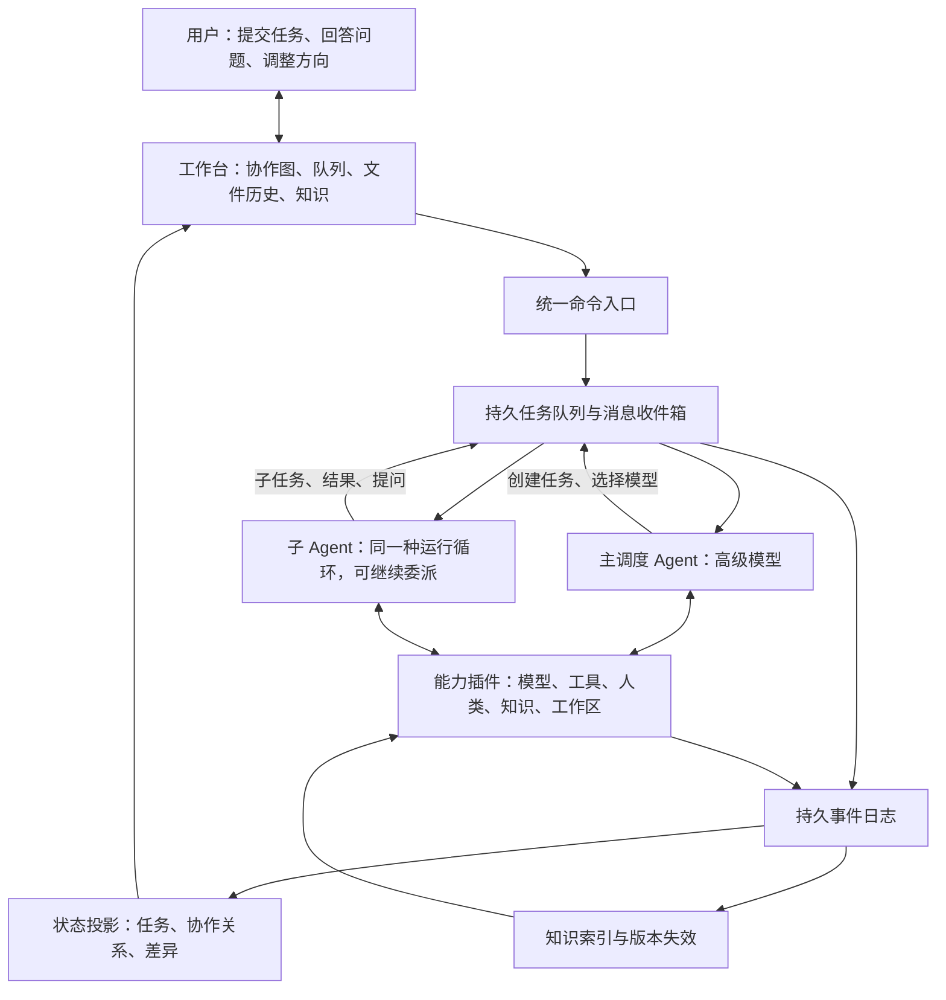

# 统一多模型协作架构 v4

> 首个本地实现已落地：[Unison 使用说明](unison/README.md)。实现范围、验证记录和限制见 [实施记录](unison/实施记录.md)，外部程序的调用契约见 [HTTP API](unison/docs/API.md)。能力扩展现在有两种形态：**技能（skill）**（可加载的指令包，见 README「技能」一节）与 **插件**（进程内注册工具/适配器）。本文件仍作为架构设计文档。

2026-09-11 · 架构设计；已有部分本地实现，尚未完成真实模型协作评测。实现差异见实施记录。

本版补充 compact、主模型直接编码、子消息合批和按需冲突解决，并移除预算计算、通知功能与模型安全权限。v3 保存在 [archive/融合方案设计-v3.md](archive/融合方案设计-v3.md)。v2 保存在 [archive/融合方案设计-v2.md](archive/融合方案设计-v2.md)。核心选择：让 AI 决定如何工作，以统一的 Agent 循环、工具协议和事件记录承载协作。原版保存在 [archive/融合方案设计-v1.md](archive/融合方案设计-v1.md)。

## 1. 架构原则

**一个 Agent 抽象，一个事件事实源，一组可组合能力。主调度者与子智能体使用同一套运行机制。**

AI 自主决定任务拆分、模型选择、串行或并行、继续委派、请求人类、验证方式以及何时交付。程序不根据“简单/中等/复杂”分派固定流程，也不强制所有任务经过规划者、执行者和审查者。

运行时保留少量与任务内容无关的不变量：调用格式合法、任务不被重复领取、结果不覆盖较新的版本、取消有效。这些是执行语义，不是替 AI 编写业务决策树。AI 的自主性不要求程序放弃状态一致性。

流程图展示运行中形成的协作关系；可以单独展示 AI 提出的计划，但必须与已经执行的事实区分。

DeepSeek Harness 的启发是能力插件化：模型、工具、会话、调度和 UI 经由服务和事件协作，其 Cordis 内核只处理插件生命周期与依赖。本方案借鉴这一分层，不宣称下面的自定义协议已由 DSH 实现。[官方介绍](https://www.deepseek.com/harness/)

### 信任模型与功能边界

按用户要求，所有接入模型采用同等信任：移除模型工具白名单、逐模型权限、工具审批和安全策略插件。主模型及子模型均可使用当前环境提供的全部工具。运行时版本检查、取消、租约和原子写入仍用于避免并发错误；工作区分开用于保存分支与防止文件互相覆盖，不作为模型安全沙箱，不承诺阻止受信任模型跨目录访问。

移除通知中心、推送、弹窗提醒及其通知策略。用户打开工作台即可看到实时状态和待回答问题；人类介入功能保留。Agent 收件箱、内部事件与事件唤醒是协作协议，继续保留，且消息到达不必立即触发模型推理。

## 2. 一张架构图



图中的队列分配执行资源；主调度模型决定任务的语义安排。文件变化、token 流等高频事件写入日志和界面，不自动逐条唤醒主模型。需要主模型处理的用户消息、阶段结果和问题进入其收件箱，合批后在下一次模型调用时读取。

## 3. 极小内核与能力插件

内核只提供插件注册/依赖/生命周期、服务查找和事件分发。持久日志、Agent 循环、队列等也以插件实现；默认产品组合要求它们存在，但接口允许替换。

| 能力 | 职责 | 面向 AI 的接口示意 |
|---|---|---|
| Agent Runtime | 会话、收件箱、模型调用和继续执行 | 通常由运行时驱动 |
| Model Catalog | 可用模型、能力、实测表现、上下文与工具支持 | `models.list` |
| Tasks | 创建任务、依赖、优先级、领取、暂停和恢复 | `tasks.submit/get/update/yield/resume/cancel` |
| Goals | 需求版本、变更接收、替换计划与结果采纳 | `goals.propose_revision/activate_revision` |
| Communication | 给父级、子级或其他会话发消息 | `agents.send` |
| Human | 创建问题、收取回答、恢复关联任务 | `human.ask` |
| Knowledge | 检索、读取版本化知识、提交有来源的结论 | `knowledge.search/read/publish` |
| Workspace | 读取、编辑、执行命令、查看差异、快照与归档 | `workspace.*` |
| Artifacts | 发布产物和任务报告 | `artifacts.publish`、`tasks.complete` |
| Observability | 事件投影、协作图和回放 | UI 订阅，无须 AI 重复描述 |

接口是本方案的概念协议，不是现成 SDK。工具名称可以调整，语义必须保持稳定。插件通过显式服务接口和有版本的事件协作，不能借插件之名互相读写内部状态。

所有 Agent 使用相同循环：

```text
接收消息或任务事件
→ 组装所需上下文
→ 调用当前模型
→ 执行模型选择的工具
→ 记录结果并继续，或挂起等待，或提交任务结果
```

审查、总结、规划都是模型可以承担的工作，不新增另一种 Agent 类或另一套调度引擎。

## 4. 主调度模型与递归调用

每个用户顶层任务对应一个根 Agent，默认绑定用户选定的高级模型。它持有全局目标、约束、验收要求和任务概览，对最终交付负责。主模型可以直接工作，也可以从模型目录选择模型、描述职责并提交子任务。

子 Agent 具备相同的委派接口，可以在自己的任务范围内创建孙任务。父子之间传目标、产物引用、知识版本和简短说明，不默认复制完整聊天历史。子 Agent 可提问父级，也可直接请求人类；所有人类问题汇入统一收件箱，避免用户到处寻找。

示例：主模型委派实现接口；实现 Agent 自己发现协议不明确，于是创建协议核对任务；核对 Agent 返回来源与结论；实现 Agent 完成后上交补丁和测试记录。是否发生这层递归由模型决定。

递归结构是一棵所有权树，跨任务依赖与通信可以形成图。每个任务有唯一父任务和顶层 run_id；不允许依赖成环。父级暂停等待时释放执行槽，避免所有槽位被等待中的父 Agent 占满而使子任务无法启动。匹配的结果、其他任务消息、用户消息或控制事件到达后可恢复父级；恢复不等于子任务已经完成。

并发和递归深度是可配置资源上限，不按业务类别写死。取消任务沿所有权树传播，已完成产物仍保留。所有模型均可直接使用已安装的代码和协作工具。

### 4.1 主模型可以直接操作代码

主调度是根 Agent 的责任，不是工具能力限制。它与子 Agent 一样拥有检索、读写文件、执行命令、测试、diff 和归档能力。主模型自主选择“自己解决”或“委派出去”，不需要先调用分类模型，也不设简单任务的硬编码门槛。

当主模型直接改代码时，照常生成工作区记录和结束报告。已有子任务并行改动相同文件时，主模型也采用独立分支和正常集成流程。主模型工作期间，子消息进入收件箱，在工具或模型调用边界合批读取，不因每个进度消息重启主会话。

## 5. 队列：所有任务采用相同语义

用户任务和 AI 子任务都进入同一个持久化任务系统，通过 parent_id 区分层级。模型负责选择依赖、优先级和执行者；队列负责依赖就绪、资源可用后的执行。模型没有指定优先级时使用稳定的提交顺序，同优先级采用公平调度，避免长期饿死。

```text
Task = {
  id, run_id, parent_id, goal_revision, goal, acceptance,
  model_ref, agent_id, dependencies, priority,
  context_refs, workspace_ref,
  status, wait_spec, inbox_cursor, continuation_ref,
  result_refs, version, execution_epoch
}

状态：queued → running → waiting / completed / failed / cancelled / superseded
waiting → queued（匹配唤醒事件；带原因恢复，不假定等待条件已满足）
queued / running / waiting → superseded（被新需求版本替代）
```

顶层任务可先由根 Agent 承接，后续由它安排执行。未指定模型的子任务在接受时绑定父级当前模型，作为可见的默认值；不另加隐式“智能路由器”替父模型作选择。模型不可用时产生明确事件，由相关 Agent 选择替代或等待；不会悄悄换模型。

每次领取使用租约和执行代次；租约过期可恢复，旧执行者的迟到结果不能覆盖新代次。任务状态更新与事件发布使用同一事务或事务 outbox，消费者按 event_id 去重。恢复队列不意味着外部工具能恰好执行一次：有副作用的调用记录幂等标识，状态不明时先核实结果。

### 5.1 工作任务与调度动作分开

用户可以在 UI 中看到“执行、等待、继续”等类型，但它们共用同一个任务与消息系统：执行产生工作，等待保存续接点并让出资源，继续把新事件交给原任务。等待和继续不另建一条只能等待子模型最终结果的流程，也不需要无限生成新的任务 ID。

AI 可以在委派后继续自己的其他工作；只有主动 `tasks.yield` 才挂起当前任务。父 Agent 可以有多个未完成子任务，收到任何相关消息后重新决定下一步。

```text
tasks.yield({
  task_id, after_cursor,
  wake_on: [
    { type: "TaskCompleted", task_id: "A" },
    { type: "MessageDelivered", from_task: "B", topic: "interface" },
    { type: "HumanAnswered", question_id: "Q" }
  ],
  mode: "any", deadline?, continuation_ref
})

tasks.resume({ task_id, cause_event_id, message_ref })
```

`wake_on` 是 AI 声明的事件订阅，不是预置业务决策树。`any` 收到一个匹配事件就唤醒；明确需要全部证据时可用 `all`，其已满足集合持久化。需求变更、取消和用户明确介入属于控制事件，独立于订阅条件，不会被 `all` 拦住。普通消息只有匹配订阅或通过 resume 请求才唤醒，避免任意日志引发模型调用。

示例：主 Agent 等 A 写完接口；B 提前发来“接口协议存在冲突”，即使 A 仍在运行，主 Agent 也能恢复，决定给 A 发消息、调整计划、询问用户或继续等待。等待对象是有用的新事件，不只是模型最终答案。

### 5.2 避免丢失唤醒、重复唤醒和空转

- 注册等待、检查 `after_cursor` 之后的已到达事件、变更任务状态在同一事务内完成；事件先到也不能漏掉。已消费事件不能再次满足新一轮等待。
- 同一任务最多一个活跃执行代次。多个唤醒合并进收件箱；运行中的任务收到消息时在安全边界读取，不启动另一个并发模型覆盖同一会话。
- 一次等待被唤醒后返回触发原因、匹配事件和仍未完成项。原订阅消费或注销，再次等待必须显式登记新游标；不能反复被同一个“完成”事件唤醒。
- `resume` 需要唯一原因事件；重复投递幂等，不得恢复 cancelled 或 superseded 的任务。
- 无事件时不调用模型轮询。可选 deadline 产生一次 `WaitExpired` 事件，让 AI 决定下一步；不会自动判定子任务成功或周期性无限续等。
- 静态硬依赖环拒绝注册。动态等待形成封闭环、没有可运行任务且没有外部订阅/定时器时，产生去重的 `RunStalled` 控制事件供主调度处理。等待人类可长期存在，并不自动视为死锁。
- 反复互相发消息属于另一种活锁：按事件因果链记录无新增产物/状态的重复唤醒，在配置的执行并发与重复调度限制下合并消息、限制空转并交由主模型或人类处理。事件驱动减少空等，但不能保证 AI 永不产生语义循环。

UI 显示“等待什么、谁能唤醒、最近唤醒原因、未完成依赖”；继续运行与依赖满足分别显示。缺少必需结果时，AI 可以规划或交流，但不能把缺失证据标为已获得。

### 5.3 子消息插话：先进入收件箱，再决定是否调用模型

“消息持久化”“唤醒任务”和“发起模型调用”是三个独立动作。子消息到达只要求第一步立即完成，UI 可直接更新；只有存在需要处理的输入且任务可运行时，才排入一次模型调用。

发送者使用统一信封声明意图：

```text
Message = {
  id, run_id, goal_revision, from_task, to_task,
  kind: progress | result | question | blocker,
  topic, summary, artifact_refs,
  delivery: inbox | wake,
  supersedes_message_id?, correlation_id
}
```

AI 自主选择 kind 和 delivery。默认 inbox 不主动调用主模型；主模型可通过等待订阅选择感兴趣的事件，问题或阻塞也可显式请求 wake。消息要包含可判断的短摘要，详细输出用版本化产物引用；引用不会让模型自动知道文件内容，需要时再读取。

处理规则只针对运行语义：

- 主模型正在运行：接收消息并持久化，在下一次模型请求前把当前批次追加进去，不取消重启当前推理。同一时刻只有一个主模型执行代次。
- 主模型挂起：匹配订阅或显式 wake 产生一个待运行项；在短且有最大延迟的可配置合批窗口内收集其他消息，窗口不因新消息不断延长。用户停止/改向控制直接生效，不等合批。
- 普通进度：仅更新任务投影和收件箱，不调用模型。没有唤醒请求和订阅就继续保存；Agent 等待退出时应声明需要的终态/失败事件，不能靠轮询检查。
- 批次装配不额外调用“消息总结模型”。按 ID 去重，只有发送者明确声明替代关系的进度消息才保留最新值作为默认展示；不同产物、问题和决定全部保留。超长批次提供目录和待读引用，未读取的重要问题维持未处理状态，不能截断后假装已经处理。
- 一次调用处理多个消息，完成后推进已处理游标；新来的消息属于下一批。仅当未处理消息满足唤醒规则时继续运行，不为普通状态更新空转。

例如 10 个子任务每个发 5 条进度并最终提交结果：50 条进度可全部零模型调用地进入日志；终态根据主模型设置的 any/all 订阅或短窗口合批处理。不能保证 10 个先后完成的任务始终只触发一次推理，但不会机械地为 60 条消息各调用一次主模型。

通常的聊天 API 每次推理仍需要当前有效上下文；前缀命中可复用部分计算，不能消除整次推理，也不能让共享知识天然驻留在模型中。首先减少调用次数，其次减少有效上下文，再保持稳定前缀。不要为每条插话生成 compact，也不要每轮重新拉取全部系统历史。

## 6. 人类介入是一种可等待的工具调用

AI 认为缺少信息、取舍无法确定或需要用户判断时，调用：

```text
human.ask({ question, context_refs, options?, blocking_scope })
```

系统创建持久 Question，绑定任务及问题版本。受影响任务进入 waiting，释放计算槽；无依赖关系的任务继续运行。UI 显示问题、必要背景、AI 的简短建议及影响范围。用户回答成为事件和决策记录，投递回发问 Agent 的收件箱。

不使用“置信度低于某数值”硬编码触发，也不把超时当作用户同意。用户还能主动暂停、修改目标、取消任务或补充约束。核心需求变更按下述需求版本协议处理；普通补充消息仍作为当前任务输入。

父级和子级收到同一个问题时使用问题 ID 关联，避免重复提问；语义近似的问题可提示 AI 合并，不盲目自动合并不同决策。

### 6.1 核心需求变更：切换版本，弃置旧计划

需求快照 `GoalRevision` 包含目标、约束、验收条件、来源消息与父版本。目标修改不覆盖历史文本；计划、任务、问题、结果、知识和工具执行都关联明确的 goal_revision。任务 version 是单记录更新版本，execution_epoch 是执行代次，三者不能混用。

主调度模型负责判断哪些工作仍有价值，并形成替换计划：

| 处理 | 语义 |
|---|---|
| 弃置 | 旧任务标记 superseded，停止继续执行，保留记录 |
| 复用成果 | 把旧产物作为候选，检查对新目标的适用性后由新任务显式采纳 |
| 延续工作 | 保存检查点，在新版本下创建 successor 任务；旧任务仍封存 |
| 新增 | 为新目标创建任务并建立新的依赖 |

不存在把整棵旧树删除后假装没发生过，也不允许通过直接改旧任务的 revision 使旧工作自动变成新工作。已完成任务保留 completed 事实，但它的“当前计划归属”变为 superseded；历史完成与当前适用性是不同概念。

### 6.2 需求切换协议

1. **接收变更并唤醒主模型。** 用户明确使用“替换目标”操作时，运行时立即把该 run 标为 revising，暂停旧计划的新派发和新副作用，唤醒等待中的主模型。普通自然语言消息由主模型判断是否为核心变更；明显要求停止的控制命令立即生效，不能等子模型完成。含糊之处可以提问，冻结相关范围，其他独立顶层任务继续。
2. **主模型形成新版本。** 根据新需求和简短运行概览决定弃置、复用、延续和新增的范围。提供 `goals.propose_revision` 保存方案；激活必须关联用户变更依据，主模型不能自行降低用户验收要求。明确授权的改向无需再走一次固定确认流程。
3. **原子切换。** `goals.activate_revision(expected_revision, new_revision, migration_plan)` 检查当前版本后提交新需求和任务迁移记录。旧任务执行代次失效，旧等待订阅注销，旧问题标记过时；新计划成为唯一有效计划。高优先级控制处理不消耗被等待任务占用的槽位。连续到来的用户修改逐条持久化，激活前检查新消息游标，避免较早方案覆盖更新的要求。
4. **停止旧执行。** 取消信号传播到旧任务子树，使旧代次提交当前状态和集成产物的操作失效。运行中模型可中断则中断；不可中断则把返回结果归入旧版本。已运行的 shell 可能仍写文件，所以在隔离工作区尽力终止并对账；旧进程未确认停止前不把其工作区交给新任务。
5. **建立新工作上下文。** 保持主调度 Agent 的身份，但开启新的目标执行段：新目标、变更差异、已采纳成果、剩余约束和任务概览。旧讨论供按需查询，不把旧计划继续作为有效指令注入。需求假设及其派生知识标记过时，独立的代码事实仍可保留。必要时重建上下文并接受缓存冷启动。
6. **继续新计划。** 新任务按正常队列运行。旧结果晚到仅显示为历史产物，不唤醒新版本等待、不自动合并、不满足新验收。AI 若认为仍有价值，通过带新版本验证记录的显式采纳事件复用。旧问题的迟到回答也不直接恢复任务，只在仍有关联时供主模型重新解释。

“revising”是 run 的控制阶段，主调度的变更处理仍可运行。主模型崩溃或变更期间重启时，该阶段与控制消息持久保留，恢复后继续处理，不能静默恢复旧树。如果 AI 判断只是补充信息，则记录决定并解除冻结，按照原版本继续。

已经对外发生的操作不能通过需求版本回滚，必须记录并由 AI 安排补偿或请人类决策。

### 6.3 示例：从本地导出改为云端同步

旧目标 r1：“做 CSV 导出”，主模型已委派界面 A 和导出 B。用户改为“取消导出，做云端同步”。主模型弃置 B，判断 A 的部分界面布局可复用，在 r2 下建立新任务并引用其快照；新增同步接口工作。

即使 B 随后提交 CSV 代码，该补丁也只属于 r1，不能进入 r2。协作图默认显示 r2，r1 折叠为“已被新需求替代”；可以展开查看弃置原因、文件历史及哪些成果被 r2 采纳。

## 7. 流程图：从事件还原当前协作

第一版就提供可视化，不推迟为后期功能。

- 节点显示任务、Agent、实际模型、简短目标、状态、耗时和产物。
- 边区分委派、依赖、消息与结果回传。子树可折叠；可定位当前正在执行或等待人类的节点。
- 计划使用虚线，真实执行使用实线；节点保留模型提出的简短调度理由，不推测隐藏思维过程。
- 点开节点查看消息、工具结果、引用知识、文件改动、测试证据与缓存数据。
- 时间轴支持观察历史状态。回放仅重建界面和状态，不重新运行工具。
- UI 的暂停、取消、回答、重新排队通过同一命令入口，不能直接篡改投影数据库。

队列、协作图、文件视图和消息视图从同一份持久事件派生，可重新构建。流式输出作为短暂事件展示，完整消息提交后才作为持久事实；重连按事件游标补齐。

## 8. 文件修改：被动记录，主动解释

记录不能依赖模型记得提交 Git 或主动写日志。工作区插件负责采集事实，模型补充修改意图。

### 记录机制

任务开始记录基线，包括原有未提交修改。编辑工具执行前后捕获文件版本；shell、外部编辑器和用户修改由文件监听发现，再以扫描和内容哈希核对。工具边界和任务结束必须做差异对账，发现日志遗漏。

监听器可能合并事件或漏掉短暂的中间写入，不能承诺捕获系统中每一次瞬时落盘。目标是可靠保存基线、观测到的版本、工具边界版本及最终差异。删除、重命名、二进制文件分别显示；未知修改来源明确标注，不能仅凭时间邻近归因给某个 Agent。

修改记录包括：路径、前后内容哈希、内容对象/差异引用、任务、已知执行者、工具调用、时间与验证引用。大文件按配置保留对象或元数据并显示记录范围；排除目录及无法归档项在 UI 明示。

### 并行与归档

并行写入任务使用隔离工作区；其工作区生命周期和归档由插件负责。集成以明确的版本为基础形成新的变更记录，同一文件冲突交给 Agent 解决，必要时询问人类。

发生问题可归档任务事件、文件对象、差异、报告和知识版本，保留失败现场。归档与恢复是两个操作：归档不改当前文件；恢复在新工作区或先保存当前状态后进行，不能覆盖用户后续改动。Agent 崩溃时仍可归档，并标注报告未生成。

### 任务结束报告

运行时根据真实差异生成文件清单，交由该任务 Agent 填写修改原因，再校对路径覆盖率。每项含：文件、变更摘要、修改原因、关联目标、验证记录和可能影响。原因由 AI 陈述，事实来自文件记录，两者分开存放。

报告同时提供 Markdown 和结构化数据供其他模型查询。父任务报告聚合子任务变更，保留作者与来源；发现遗漏或未知原因时明确标注。文件报告写入知识库，后续 Agent 可直接查询“这个文件为什么变过”，并跳转到原始 diff。

### 8.1 代码冲突：自动检测，按需处理

第一版不维护独立的常驻“冲突调解树”。现有任务树记录委派，版本图记录代码来源，冲突只是可以由普通 Agent 处理的一类任务。额外建立一棵不断调解的 AI 树会增加协调调用，并不保证语义正确。

每个变更提交 base_revision、head_revision、changed_paths 和变更说明。集成插件串行更新集成分支，基于共同祖先做三方合并；提交前检查集成 head 未改变，改变时重新基于新 head 集成。文本可无冲突合并时由程序直接执行，随后运行适用的构建/测试，结果不能仅凭“Git 没冲突”判定成功。

遇到文本冲突或集成测试失败，生成带基础版本、两侧差异、相关目标和日志引用的 Conflict 记录。先交给最近的共同父任务作为普通消息，由该 Agent 选择自己解决、请原作者协调、创建一个解决冲突的子任务或询问人类。子 Agent 可继续委派，但不新增专用调解运行时。

确实独立的任务可以并行，明显重叠的文件可由 AI 约定先后顺序。路径重叠只是证据，不强制等同于冲突。未解决的冲突不进入已集成版本；通过验证的结果记录来源和处理原因。跨文件语义冲突仍可能漏测，需要按实际任务选择验证方式，不能宣称自动维护树就能解决。

## 9. 共享上下文：版本化知识库 + 按需装配

共享上下文是一份可检索的项目知识，不是所有模型共享同一个无限聊天窗口，也不是模型看到了文件路径就自动知道内容。

保存三类信息：

1. 项目知识：项目用途、目录地图、运行命令、模块职责、约束、架构决策。
2. 任务知识：当前目标、进展、未解决问题、用户决定、验证结果。
3. 变更知识：文件修改原因、版本关系、失败记录和后续影响。

每条知识有 id、scope、goal_revision（需求相关知识）、来源路径/对象、source_hash、知识版本、创建任务、验证状态及依赖。用户明确决定可直接成为决策记录；AI 推断与已验证事实分开。跨项目共享只使用明确属于通用范围的知识，不能默认混用项目约束。

### 解决“每换一个模型就总结 README”

第一次需要了解项目时，Agent 可提交理解项目的任务，产出带来源的项目简报并发布到知识库。也可以由当前 Agent 直接完成，没有必须存在的“README 总结员”。

后续 Agent 默认获得小型项目索引、任务目标和知识版本引用，再按需读取简报、模块信息及原始文件。简报仍有效时直接复用，不再生成一次。检索和读取是普通工具调用，AI 决定是否深入。

文件变更事件自动标记直接及传递依赖的知识为待刷新。待刷新知识不能作为当前事实静默注入；查询返回失效原因和新来源，Agent 可选择重新读取或更新。更新仅针对受影响模块，保留历史版本供回放。单一文件哈希不足以确认跨模块结论仍然有效，因此知识也需要依赖图。

同一项目版本、同一知识主题的生成请求合并为单次在途工作，避免多个 Agent 同时付费总结相同材料。原始文件仍是事实依据；摘要省去重复理解，但不能保证足够支持所有修改。

### Context Builder

上下文装配插件把共同协议、稳定项目简报、当前目标及按需检索结果变成模型可读输入，并记录实际注入的知识版本和 token 数。版本校验、重复片段去重和请求格式由程序保证；“需要什么知识”由 AI 的读取与检索行为驱动。

新 Agent 的冷启动包保持精简。单个 Agent 的进行中会话以追加新信息为主，避免每一步重新排列历史。文件更新以新版本和失效事件追加；达到需要压缩或重建会话的时机时创建新的上下文版本，接受缓存重新建立。不能为维持缓存继续使用过时资料。

### 9.1 Compact 压缩的对象与时机

compact 压缩的是模型下一次要读的工作上下文。原始事件日志、文件版本和用户原始需求不被摘要覆盖；磁盘日志可无损压缩存储，UI 可折叠显示，历史回放仍读得到原文。

| 对象 | 默认处理 | 何时做语义 compact |
|---|---|---|
| 工具输出 | 输出落盘，按结果类型提取退出码、失败片段、关键摘要和可检索引用 | 一组工具操作结束且旧细节不再是当前工作必需时；不为每条输出调用总结模型 |
| 主/子 Agent 会话 | 保留稳定指令、目标、工作状态、近期完整交互 | AI 主动请求、上下文将装不下下一轮，或切换核心需求时重建 |
| 原始日志 | 仅追加、索引、无损归档 | 不做替代原文的有损 compact |
| 共享知识 | 按来源版本复用，变更后局部刷新 | 模块知识确实变化或重复结论需要整理时，不随每次消息刷新 |

模型可调用 `context.compact`；运行时只增加一个容量保障：当下一次输入估算加所需输出空间及工具响应余量接近该模型可用窗口时，在完整交互边界提前生成检查点。不写死统一的 token 数或“每 N 轮”；窗口与余量由模型适配器配置，属于上下文容量而不是费用预算。单次超大工具结果应在进入提示词前引用化或分段读取，不能等溢出后再补救。

compact 保留结构化续接材料：当前 goal_revision、用户硬要求和原文引用、已确认决策、工作计划、文件版本与变更、子任务状态、未解问题、等待订阅、已消费消息游标、下一步及证据引用。仍未完成的工具调用及其协议关联不得被拆断；近期交互作为原文尾部保留。运行时任务状态和原始用户要求直接从事实源装配，不由摘要模型重新猜测。

自动压缩采用同一 Agent Runtime 的一次 maintenance 调用，可复用当前模型，默认不委派新的总结 Agent。摘要结果绑定被压缩的事件区间、目标版本和内容哈希；成功校验必要字段后原子激活新的 context_epoch，期间到达的消息追加在快照之后。字段缺失、摘要失败或同时发生目标切换时保留原上下文并中止该次激活，不能用不完整摘要继续。严重超长时只提供必需材料与历史检索入口，不递归压缩到丢掉当前问题。

避免长期“摘要再摘要”：结构状态每次取最新事实源，摘要引用可追溯到原始事件；需要重建时按原始区间和模块知识生成，而非只依赖上一版摘要。它仍是有损总结，所以重要决策与源文件必须可再读取。

> **实现说明（2026-09-11 第二轮）**：本节的 compact 时机已按"当轮立即生效"落地。模型调用 `context_compact` 后，运行时不等待下一轮调度，也不设人工批准：在本轮工具批次执行完毕处立即压缩，并在同一次调度内用压缩后的上下文继续推理（`step()` 循环 + `_model_round()` 单轮，连续压缩上限 3）。等待中的任务仍在下一次被调度时生效；同一轮以 `tasks_complete` / `tasks_yield` / `human_ask` 结束时本次请求不生效。可压缩区间为空时不调用模型、不改写历史。

工具输出裁剪、消息合批和知识复用优先执行；compact 不是每轮必跑的流程。它通常减少后续输入，但也增加一次处理并可能打断前缀缓存，因此在任务仍能舒适运行时不反复 compact。

## 10. Cache hit 与知识复用分别节省什么

| 层次 | 复用对象 | 节省方式 | 跨模型情况 |
|---|---|---|---|
| 结果/知识复用 | 已有项目简报、结论、文件说明 | 避免重新调用模型总结 | 内容可以跨模型读取，读取仍计入输入 |
| 按需检索 | 与当前任务相关的少量内容 | 减少输入长度与无关信息 | 所有适配模型均可使用 |
| 服务商前缀缓存 | 已计算过的输入前缀 | 命中部分采用缓存计价，可能减少首 token 延迟 | 不假定跨模型、跨供应商或跨账号共享 |

知识库保存的是可读内容；服务商缓存保存的是模型计算可复用的状态。统一 API 格式不使不同模型的缓存兼容。缓存命中也不免除输出生成的费用，不会扩大模型可用上下文。

DeepSeek 当前官方说明：缓存默认启用，需要完整匹配已经持久化的前缀单元；公共前缀有时需要先被系统识别持久化，不能保证第二次请求命中。命中尽力而为，缓存建立需要时间，也会被清理。实际使用 `prompt_cache_hit_tokens` 与 `prompt_cache_miss_tokens` 检查。[官方缓存指南](https://api-docs.deepseek.com/guides/kv_cache/)

### 输入组织建议

```text
稳定的共同指令与工具定义
稳定的项目简报版本（仅适用于需要该项目的任务）
当前 Agent 的职责与当前任务
该会话的消息历史、检索片段和新增结果
```

这是逻辑布局，具体消息角色和序列化由供应商适配器实现。共同指令放在高优先级指令区，项目资料按资料处理，不把项目资料误当作调度指令。同一模型和兼容配置的 Agent 尽量保持共同部分一致；独特职责、时间、任务 ID 等动态内容放在允许的位置靠后。工具集合确需不同或能力协议要求不同前缀时，接受缓存分组，不伪装能力。

同一会话固定工具排序、序列化和摘要版本，避免无意义改写前缀。首次并行请求可能都未命中，不应假定它们天然互相预热；只有测量证明划算时才考虑预热，不默认添加额外付费请求。检索段采用稳定排序，但不为命中率强塞整个仓库。

### 保留上下文优化，移除预算产品功能

不实现费用账本、价格表、预算分配/预留/结算、金额上限或费用面板。上下文长度检查仅用于适配模型窗口；供应商返回的原始 token/cache usage 可随请求日志保存，用于排查重复输入和缓存行为，不做金额换算或预算决策。

缓存优化服务于更高效的模型调用，但不把命中率作为完成质量的替代指标。compact 改写前缀后可能需要重新建立缓存，不应每收到一条消息就重新总结整个会话。复用会话 ID 或只传增量是传输层能力，并不自动意味着服务商只计算或只收取新增 token；以具体 API 和 usage 为准。

## 11. 统一事件和数据契约

```text
Event = {
  event_id, run_id, goal_revision, task_id, agent_id?, execution_epoch?,
  type, sequence, timestamp, causation_id?,
  payload_ref, schema_version
}

事件示例：
TaskSubmitted / TaskClaimed / TaskWaiting / TaskWoken / TaskCompleted / TaskSuperseded
WaitRegistered / WaitExpired / RunStalled
GoalChangeReceived / GoalRevisionActivated / ArtifactAdopted
AgentDelegated / MessageDelivered / InboxBatchReady / ModelCalled
ContextCompacted / ConflictDetected / IntegrationCommitted
QuestionRaised / HumanAnswered
FileVersionRecorded / SnapshotArchived / ChangeReportPublished
KnowledgePublished / KnowledgeInvalidated / ContextAssembled
```

持久事件是已经发生的事实，命令是希望执行的动作，二者不能混用。大内容放内容寻址对象库，事件只存引用；任务和 UI 状态可以由事件重建，查询用投影加速。数据库迁移和事件 schema 升级需要兼容历史记录。

任务结果至少包含 summary、artifact_refs、change_report_ref（有文件变更时）、evidence_refs、unresolved_items。任务完成与验证结论是不同字段：完成意味着 Agent 已提交结果，验证状态可为通过、失败或未验证；不能在 UI 中把“AI 说完成了”显示为“验证已通过”。

## 12. 一次实际协作如何展开

用户提交“给项目增加导出功能”，任务立即出现在队列。主模型读取有效项目简报，决定委派实现；实现 Agent 自己选择是否召集测试 Agent。它们的委派在协作图中实时出现。

实现过程中发现导出格式不明确，Agent 发问；用户在统一问题面板回答，相关分支恢复。工作区插件持续记录版本，无须 AI 为记录历史额外调用模型。

结束时系统生成真实文件清单，实现 Agent 补齐原因与验证引用，主模型汇总交付。文件报告和项目知识更新后，下一个模型可直接检索“导出功能在哪里、为何这样实现、测试过什么”，不再从 README 重新总结。失败任务同样留下可查看的归档。

这里的每一次委派、测试或询问都是 AI 的选择；架构只提供统一的行动方式与记录方式。

## 13. 落地边界与验收

第一版必须纵向打通七项能力：真实主/子模型调用、递归任务队列、人类问答恢复、实时协作图、被动文件版本与归档、任务变更报告、共享知识复用。流程编辑器、自动学习路由和复杂向量数据库不作为先决条件。

存储可先采用 SQLite 事务事件/队列/全文索引，加本地内容对象目录；语义检索作为可替换插件。运行时优先验证 DSH 的 Agent、工具和会话接口能否承载本协议，再通过外部插件增加任务、知识、文件与可视化能力。适配实验只需证明“根 Agent 委派子 Agent、挂起、恢复及获取事件”闭环；若接口不适配，复用 Cordis 的组合方式实现薄运行时，而不同时叠加两套 Agent 循环。DSH 当前为开发者预览，依赖实现应固定版本并隔离适配层。[官方仓库](https://github.com/deepseek-ai/deepseek-harness)

验收场景：

1. 两个用户任务入队可见；队列恢复后任务不丢失，不重复提交副作用。
2. 主 → 子 → 孙递归执行，父级等待释放槽位；取消覆盖整棵子树。
3. 人类问题只阻塞关联任务；重启后回答仍能恢复正确任务。
4. 协作图显示真实模型及事件，重连后与持久状态一致。
5. 编辑工具、shell 和外部编辑产生的最终差异均被对账发现；归档能查看失败现场，恢复不丢用户后续修改。
6. 结束报告覆盖所有实际变更文件，原因、证据和未知项明确。
7. 第二个模型复用有效简报而无需重做总结；源文件变化后旧知识被标注失效，受影响内容可局部更新。
8. 保留原始 cache usage 供诊断，缺失标为未知；不提供费用统计与预算控制。验证知识复用和消息合批减少重复调用，且不遗漏关键任务信息。

9. A 尚未完成时，B 的匹配消息可唤醒等待中的父任务；先到事件不丢，多次投递只恢复一次，已消费事件不造成空转。
10. 动态封闭等待环产生一次可处理的停滞事件；等待用户不会触发自动假回答；重复唤醒消耗受资源限制。
11. 核心需求切换后，旧任务、旧结果和旧人类回答不能更新新版本；旧进程仍在执行时其工作区保持隔离。
12. 两次连续改向、切换期间崩溃和迟到模型返回均可恢复，历史归档和已采纳成果来源可追踪。
13. 主模型可不创建子任务直接改文件并运行测试，正常生成变更报告。
14. 进度消息不触发额外推理；多条唤醒合批、窗口有最大延迟、控制命令不被合批阻塞。
15. compact 前后用户约束、工具调用关联、消息游标和等待条件一致；原始日志可读，压缩过程中到达的新消息不丢失。
16. 并行分支冲突变成普通任务处理，集成分支更新串行化；无常驻调解树。
17. 当前产品不包含预算账本、价格换算、通知中心、模型权限配置或工具审批；各模型工具能力一致。

离线假模型可用于验证恢复和队列一致性，但缓存、模型自主协作和实际节省必须使用真实 API 验证。

> **实现说明（2026-09-11 第二轮）**：新增两项能力并保持"模型同等信任"的边界——(1) 凭据是模型可读的能力：`models_credentials` 返回明文 Key，`workspace_shell` 注入 `UNISON_MODEL_*` 环境变量，模型可在自己写的代码里直接调用模型接口，每次读取留下 `CredentialsExposed` 事件；(2) HTTP API 服务化：外部程序用令牌调用 `/api/runs`、`/api/wait`、`/api/task`、`/api/models/credentials`，浏览器控制台同源免令牌，契约见 [HTTP API](unison/docs/API.md)。凭据明文可见意味着"工作区分开"仍只是分支机制、不是安全边界。
